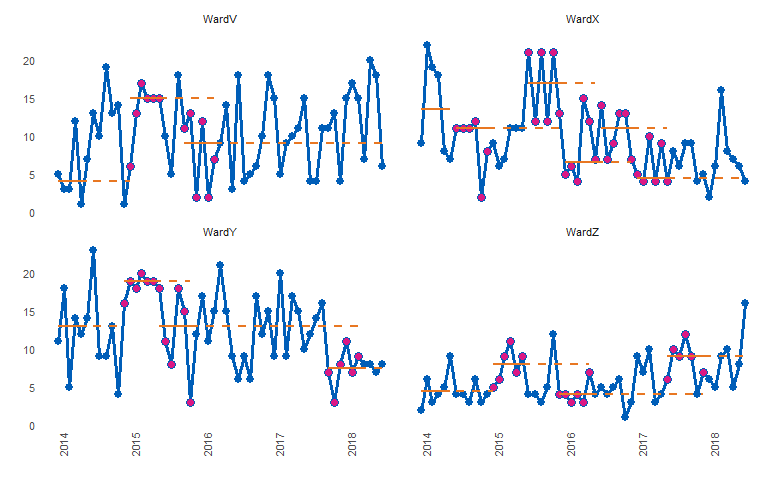

<!-- README.md is generated from README.Rmd. Please edit that file -->
runcharter 
=========================================================================

Automated analysis and re-basing of run charts at scale.

Online documentation and vignettes : [runcharter](https://www.johnmackintosh.com/runcharter/)

[](https://travis-ci.org/johnmackintosh/runcharter) [](https://www.repostatus.org/#wip) [](https://codecov.io/github/johnmackintosh/runcharter?branch=master)

Installation
------------

You can install runcharter from github with:

``` r
# install.packages("devtools")
devtools::install_github("johnmackintosh/runcharter")

# to ensure the vignettes are built or ensure latest version is installed:

devtools::install_github("johnmackintosh/runcharter", 
                         build_vignettes = TRUE, force = TRUE)
```

Rationale
---------

Run charts are easy to create and analyse on an individual basis, hence they are widely used in healthcare quality improvement.

A run chart is a regular line chart, with a central reference line.

This central line, calculated using the median of a number of values over a baseline period, allows the QI team to assess if any statistically significant improvement is taking place, as a result of their improvement initiatives.

These improvements are denoted by certain patterns, or signals, within the plotted data points, in relation to the median line. The main signal is a run of 9 or more consecutive values on the desired side of the median line.

If this signal occurs as a result of improvement activities, but performance is not yet at the target level, a new median line can be plotted.

This is calculated using the median of the points that contributed to the signal. The aim is to then continue to work on improvement, measure and plot data, and look for the next sustained signal, until the improvement initiative is operating at its target level.

While this 'rebasing' (calculating new medians) is manageable for a few charts, it quickly becomes labour intensive as QI initiatives expand or further QI programmes are launched.

While enterprise level database software can be used to store the raw data, their associated reporting systems are usually ill suited to the task of analysing QI data using run chart rules.

This package automatically creates rebased run charts, based on the run chart rule for sustained improvement commonly used in healthcare ( 9 consecutive points on the desired side of the median).

All sustained runs of improvement, in the desired direction, will be highlighted and the median re-phased, using the points that contributed to the run.

Non useful observations (points on the median) are ignored and are not highlighted.

The main motivation is to analyse many charts at once, but you can also create and analyse a single run chart, or iterate, plot and save many individual charts.

The runcharter function - input
-------------------------------

The function requires a simple three column dataframe, with the following column names

-   grp : a character column indicating a grouping variable to identify each individual run chart and for faceted plots
-   date : a column of type 'date'.
-   y : the variable / value to plot.

runcharter function arguments
-----------------------------

-   df : a three column dataframe with columns named 'grp', 'date' and 'y' as specified above
-   med\_rows : How many rows / data points should the initial baseline median be calculated over?
-   runlength : How long a run of consecutive points do you want to find, before you rebase the median? The median will be rebased using all useful observations (points on the median are not useful, and are ignored).
-   direction : "above" or "below" the median, or "both". Use "both" if you want to rebase the run chart any time a run of the desired length occurs, even if it is on the "wrong" side of the median line.
-   facet\_cols : the number of columns in the final faceted plot
-   chart\_title : The main title for the chart
-   chart\_subtitle : A subtitle for the chart
-   save\_plot : Calls ggsave if TRUE, saving in the current working directory
-   plot\_extension : one of "png", "pdf" or other valid extension for saving ggplot2 plots. Used in the call to ggsave.
-   line\_colr : Colour for run chart lines
-   point\_colr : Colour for run chart points
-   median\_colr : Colour for solid and extended median lines
-   sus\_fill : Fill colour to highlight points in a sustained run
-   ... : further arguments passed on to function

example plot
------------

``` r
library(runcharter)
library(dplyr)
#> Warning: package 'dplyr' was built under R version 3.5.2
#> 
#> Attaching package: 'dplyr'
#> The following objects are masked from 'package:stats':
#> 
#>     filter, lag
#> The following objects are masked from 'package:base':
#> 
#>     intersect, setdiff, setequal, union

signals %>%
dplyr::filter(grp == "WardX") %>%
runcharter(med_rows = 13,
runlength = 9,
chart_title = "Analysis of runs below median",
chart_subtitle = "Ward X",
direction = "below")
#> $runchart
#> 
#> $median_rows
#> # A tibble: 1 x 4
#>   grp   startdate  enddate    StartBaseline
#>   <chr> <date>     <date>             <int>
#> 1 WardX 2014-01-01 2015-01-01            11
#> 
#> $sustained
#> # A tibble: 1 x 5
#>   grp   improve startdate  enddate    runend    
#>   <chr>   <int> <date>     <date>     <date>    
#> 1 WardX       6 2016-12-01 2017-08-01 2018-07-01
```


Plot explanation
----------------

-   `med_rows` defines the initial baseline period. In the example below, the first 13 points are used to calculate the initial median. This is represented with a solid orange horizontal line. This median is then used as a reference for the remaining values, denoted by the extending orange dashed line

-   `runlength` specifies the length of run to be identified. Along with `direction`, which specifies which side of median represents improvement, the runlength is your target number of successive points on the desired side of the median (points on the median are ignored as they do not make or break a run). You can set the `direction` as either "above" or "below" the line, to evidence improvement in a specific direction. Searching for runs in "both" directions is also possible. This might be more applicable for long term monitoring, rather than improvement purposes.

If a run is identified, the points are highlighted (the purple coloured points), and a new median is calculated using them. The median is also plotted and extended into the future for further run chart rules analysis, with a new set of solid and dashed horizontal lines.

The analysis continues, rebasing any further runs, until no more runs are found or there are not enough data points remaining.

Example
-------

By default the function returns a faceted plot, highlighting successive runs below the median:

``` r
library(runcharter)
runcharter(signals, 
           direction = "below",
           facet_cols = 2)
#> $runchart
```


    #> 
    #> $median_rows
    #> # A tibble: 4 x 4
    #>   grp   startdate  enddate    StartBaseline
    #>   <chr> <date>     <date>             <int>
    #> 1 WardV 2014-01-01 2015-01-01             7
    #> 2 WardX 2014-01-01 2015-01-01            11
    #> 3 WardY 2014-01-01 2015-01-01            13
    #> 4 WardZ 2014-01-01 2015-01-01             4
    #> 
    #> $sustained
    #> # A tibble: 2 x 5
    #>   grp   improve startdate  enddate    runend    
    #>   <chr>   <int> <date>     <date>     <date>    
    #> 1 WardX       6 2016-12-01 2017-08-01 2018-07-01
    #> 2 WardY       8 2017-10-01 2018-06-01 2018-07-01

You can also look for any run, in any direction

``` r
library(runcharter)
runcharter(signals, 
           direction = "both",
           facet_cols = 2)
#> $runchart
```


    #> 
    #> $median_rows
    #> # A tibble: 4 x 4
    #>   grp   startdate  enddate    StartBaseline
    #>   <chr> <date>     <date>             <int>
    #> 1 WardV 2014-01-01 2015-01-01             7
    #> 2 WardX 2014-01-01 2015-01-01            11
    #> 3 WardY 2014-01-01 2015-01-01            13
    #> 4 WardZ 2014-01-01 2015-01-01             4
    #> 
    #> $sustained
    #> # A tibble: 3 x 5
    #>   grp   improve startdate  enddate    runend    
    #>   <chr>   <int> <date>     <date>     <date>    
    #> 1 WardX       6 2016-12-01 2017-08-01 2018-07-01
    #> 2 WardY       8 2017-10-01 2018-06-01 2018-07-01
    #> 3 WardZ       9 2017-06-01 2018-03-01 2018-07-01

Note how runs below the median are found for Wards X and Y, while a run above the median is highlighted for Ward Z.

The function will print the plot, and return a list, containing:

-   the plot as a ggplot2 object,
-   a dataframe / tibble summarising the rows of data used to calculate the baseline median
-   if applicable, a dataframe / tibble summarising each sustained period of improvement.

Don't try this at home - setting runlength of 6 and searching in both directions to confirm that successive runs are identified:

``` r
library(dplyr)
signals %>% 
  runcharter(med_rows = 6,
             runlength = 6, 
             direction = "both")
#> $runchart
```



    #> 
    #> $median_rows
    #> # A tibble: 4 x 4
    #>   grp   startdate  enddate    StartBaseline
    #>   <chr> <date>     <date>             <dbl>
    #> 1 WardV 2014-01-01 2014-06-01           4  
    #> 2 WardX 2014-01-01 2014-06-01          13.5
    #> 3 WardY 2014-01-01 2014-06-01          13  
    #> 4 WardZ 2014-01-01 2014-06-01           4.5
    #> 
    #> $sustained
    #> # A tibble: 13 x 5
    #>    grp   improve startdate  enddate    runend    
    #>    <chr>   <dbl> <date>     <date>     <date>    
    #>  1 WardV    15   2015-01-01 2015-06-01 2016-03-01
    #>  2 WardV     9   2015-10-01 2016-03-01 2018-07-01
    #>  3 WardX    11   2014-07-01 2014-12-01 2015-12-01
    #>  4 WardX    17   2015-07-01 2015-12-01 2016-06-01
    #>  5 WardX     6.5 2016-01-01 2016-06-01 2016-12-01
    #>  6 WardX    11   2016-07-01 2016-12-01 2017-06-01
    #>  7 WardX     4.5 2017-01-01 2017-06-01 2018-07-01
    #>  8 WardY    19   2014-12-01 2015-05-01 2015-11-01
    #>  9 WardY    13   2015-06-01 2015-11-01 2018-03-01
    #> 10 WardY     7.5 2017-10-01 2018-03-01 2018-07-01
    #> 11 WardZ     8   2015-01-01 2015-06-01 2016-05-01
    #> 12 WardZ     4   2015-12-01 2016-05-01 2017-12-01
    #> 13 WardZ     9   2017-06-01 2017-12-01 2018-07-01
