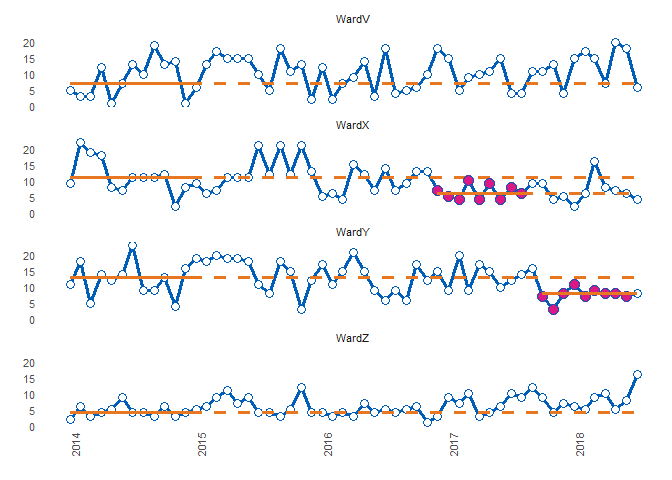
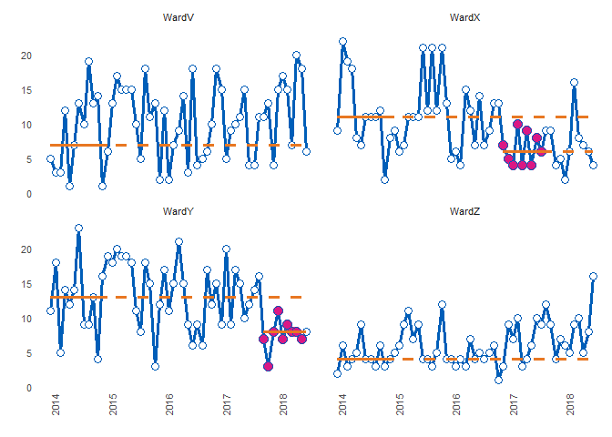
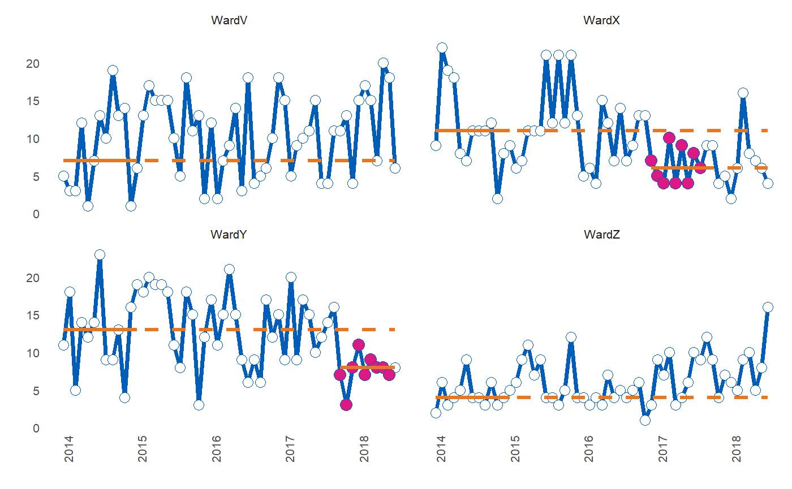
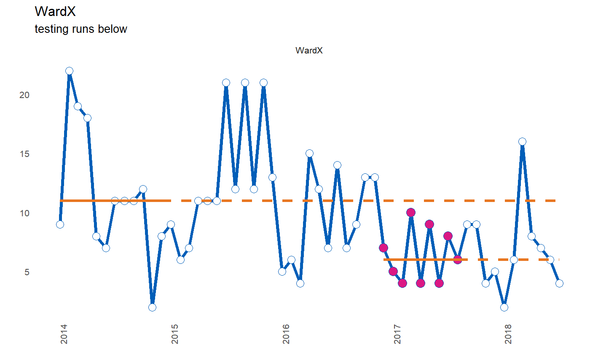
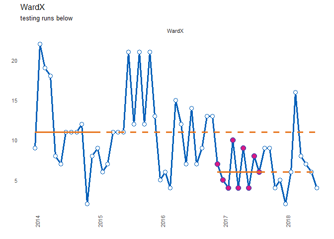
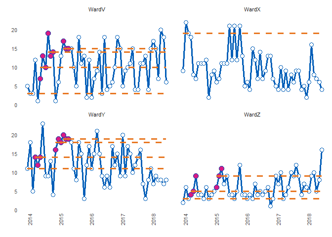
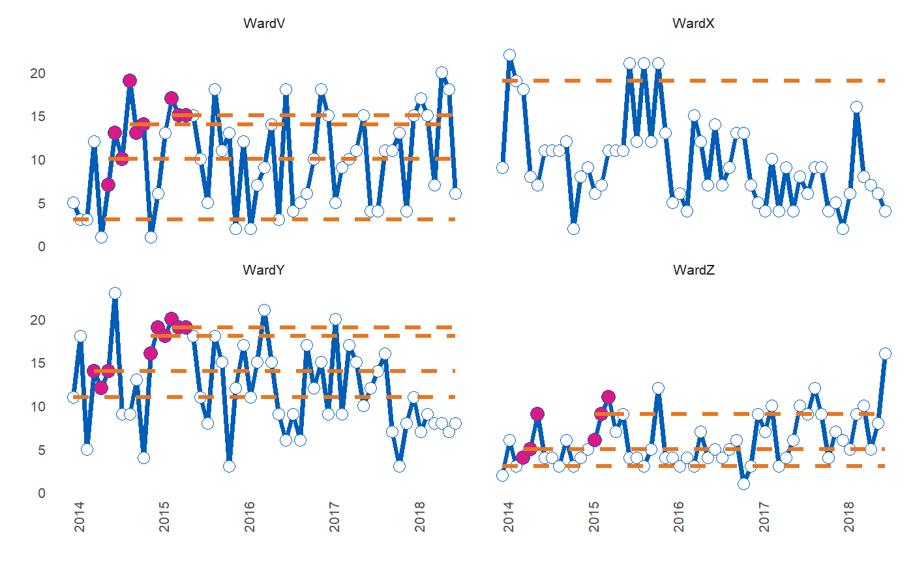

<!-- README.md is generated from README.Rmd. Please edit that file -->
runcharter
==========

Automated analysis and re-basing of runcharts at scale.

Online documentation and vignettes : [runcharter](https://www.johnmackintosh.com/runcharter/)

[](https://travis-ci.org/johnmackintosh/runcharter) [](https://www.repostatus.org/#wip) [](https://codecov.io/github/johnmackintosh/runcharter?branch=master)

Installation
------------

You can install runcharter from github with:

``` r
# install.packages("devtools")
devtools::install_github("johnmackintosh/runcharter")
```

Rationale
---------

Run charts are used extensively in quality improvement within the healthcare.

They are simple to construct and analyse using run chart rules. However over time, a signal of improvement may require a run-chart median to be rebased. While this is manageable for a few charts, it quickly becomes labour intensive as the QI initiatives spread through the organisation.

While enterprise level database software can be used to store the raw data, their associated reporting systems are usually ill suited to the task of analysing QI data using run chart rules.

This package automatically creates rebased run charts, based on run chart rules commonly used in healthcare.

The main motivation is to analyse many charts at once, but you can also create and analyse a single runchart.

All sustained runs of improvement, in the desired direction, will be highlighted and the median re-phased, using the points that contributed to the run.

Non useful observations (points on the median) are ignored and are not highlighted.

Example
-------

By default the function returns a faceted plot, highlighting successive runs below the median:

``` r
library(runcharter)
runcharter(signals, faceted = TRUE, facet_cols = 1)
```



    #> $runchart


    #> 
    #> $median_rows
    #> # A tibble: 52 x 4
    #>    grp       y date       baseline
    #>    <chr> <int> <date>        <int>
    #>  1 WardX     9 2014-01-01       11
    #>  2 WardX    22 2014-02-01       11
    #>  3 WardX    19 2014-03-01       11
    #>  4 WardX    18 2014-04-01       11
    #>  5 WardX     8 2014-05-01       11
    #>  6 WardX     7 2014-06-01       11
    #>  7 WardX    11 2014-07-01       11
    #>  8 WardX    11 2014-08-01       11
    #>  9 WardX    11 2014-09-01       11
    #> 10 WardX    12 2014-10-01       11
    #> # ... with 42 more rows
    #> 
    #> $sustained
    #> # A tibble: 18 x 10
    #>    grp       y date        flag rungroup cusum improve startdate 
    #>    <chr> <int> <date>     <dbl>    <dbl> <dbl>   <int> <date>    
    #>  1 WardX     7 2016-12-01    -1        1    -1       6 2016-12-01
    #>  2 WardX     5 2017-01-01    -1        1    -2       6 2016-12-01
    #>  3 WardX     4 2017-02-01    -1        1    -3       6 2016-12-01
    #>  4 WardX    10 2017-03-01    -1        1    -4       6 2016-12-01
    #>  5 WardX     4 2017-04-01    -1        1    -5       6 2016-12-01
    #>  6 WardX     9 2017-05-01    -1        1    -6       6 2016-12-01
    #>  7 WardX     4 2017-06-01    -1        1    -7       6 2016-12-01
    #>  8 WardX     8 2017-07-01    -1        1    -8       6 2016-12-01
    #>  9 WardX     6 2017-08-01    -1        1    -9       6 2016-12-01
    #> 10 WardY     7 2017-10-01    -1        1    -1       8 2017-10-01
    #> 11 WardY     3 2017-11-01    -1        1    -2       8 2017-10-01
    #> 12 WardY     8 2017-12-01    -1        1    -3       8 2017-10-01
    #> 13 WardY    11 2018-01-01    -1        1    -4       8 2017-10-01
    #> 14 WardY     7 2018-02-01    -1        1    -5       8 2017-10-01
    #> 15 WardY     9 2018-03-01    -1        1    -6       8 2017-10-01
    #> 16 WardY     8 2018-04-01    -1        1    -7       8 2017-10-01
    #> 17 WardY     8 2018-05-01    -1        1    -8       8 2017-10-01
    #> 18 WardY     7 2018-06-01    -1        1    -9       8 2017-10-01
    #> # ... with 2 more variables: enddate <date>, lastdate <date>
    #> 
    #> $StartBaseline
    #> [1] 11 13  4  7

For the time being, the function requires a three column data frame, containing the named variables "grp", "y" and "date": "grp" is a grouping variable which will be used for faceting. "y" is the variable on the y axis. You are encouraged to ensure that any doubles have been rounded appropriately. "date" is a date column.

The function returns a list containing a faceted or series of individual runcharts plus a tibble / dataframe of the sustained data points, allowing you to perform further analysis or processing.

``` r

runcharter(signals, faceted = TRUE, facet_cols = 2)
```



    #> $runchart



    #> 
    #> $median_rows
    #> # A tibble: 52 x 4
    #>    grp       y date       baseline
    #>    <chr> <int> <date>        <int>
    #>  1 WardX     9 2014-01-01       11
    #>  2 WardX    22 2014-02-01       11
    #>  3 WardX    19 2014-03-01       11
    #>  4 WardX    18 2014-04-01       11
    #>  5 WardX     8 2014-05-01       11
    #>  6 WardX     7 2014-06-01       11
    #>  7 WardX    11 2014-07-01       11
    #>  8 WardX    11 2014-08-01       11
    #>  9 WardX    11 2014-09-01       11
    #> 10 WardX    12 2014-10-01       11
    #> # ... with 42 more rows
    #> 
    #> $sustained
    #> # A tibble: 18 x 10
    #>    grp       y date        flag rungroup cusum improve startdate 
    #>    <chr> <int> <date>     <dbl>    <dbl> <dbl>   <int> <date>    
    #>  1 WardX     7 2016-12-01    -1        1    -1       6 2016-12-01
    #>  2 WardX     5 2017-01-01    -1        1    -2       6 2016-12-01
    #>  3 WardX     4 2017-02-01    -1        1    -3       6 2016-12-01
    #>  4 WardX    10 2017-03-01    -1        1    -4       6 2016-12-01
    #>  5 WardX     4 2017-04-01    -1        1    -5       6 2016-12-01
    #>  6 WardX     9 2017-05-01    -1        1    -6       6 2016-12-01
    #>  7 WardX     4 2017-06-01    -1        1    -7       6 2016-12-01
    #>  8 WardX     8 2017-07-01    -1        1    -8       6 2016-12-01
    #>  9 WardX     6 2017-08-01    -1        1    -9       6 2016-12-01
    #> 10 WardY     7 2017-10-01    -1        1    -1       8 2017-10-01
    #> 11 WardY     3 2017-11-01    -1        1    -2       8 2017-10-01
    #> 12 WardY     8 2017-12-01    -1        1    -3       8 2017-10-01
    #> 13 WardY    11 2018-01-01    -1        1    -4       8 2017-10-01
    #> 14 WardY     7 2018-02-01    -1        1    -5       8 2017-10-01
    #> 15 WardY     9 2018-03-01    -1        1    -6       8 2017-10-01
    #> 16 WardY     8 2018-04-01    -1        1    -7       8 2017-10-01
    #> 17 WardY     8 2018-05-01    -1        1    -8       8 2017-10-01
    #> 18 WardY     7 2018-06-01    -1        1    -9       8 2017-10-01
    #> # ... with 2 more variables: enddate <date>, lastdate <date>
    #> 
    #> $StartBaseline
    #> [1] 11 13  4  7

``` r
library(dplyr)
#> 
#> Attaching package: 'dplyr'
#> The following objects are masked from 'package:stats':
#> 
#>     filter, lag
#> The following objects are masked from 'package:base':
#> 
#>     intersect, setdiff, setequal, union
signals %>%
filter(grp == "WardX") %>%
runcharter(chart_title = "WardX", chart_subtitle = "testing runs below")
```



    #> $runchart



    #> 
    #> $median_rows
    #> # A tibble: 13 x 4
    #>    grp       y date       baseline
    #>    <chr> <int> <date>        <int>
    #>  1 WardX     9 2014-01-01       11
    #>  2 WardX    22 2014-02-01       11
    #>  3 WardX    19 2014-03-01       11
    #>  4 WardX    18 2014-04-01       11
    #>  5 WardX     8 2014-05-01       11
    #>  6 WardX     7 2014-06-01       11
    #>  7 WardX    11 2014-07-01       11
    #>  8 WardX    11 2014-08-01       11
    #>  9 WardX    11 2014-09-01       11
    #> 10 WardX    12 2014-10-01       11
    #> 11 WardX     2 2014-11-01       11
    #> 12 WardX     8 2014-12-01       11
    #> 13 WardX     9 2015-01-01       11
    #> 
    #> $sustained
    #> # A tibble: 9 x 10
    #>   grp       y date        flag rungroup cusum improve startdate  enddate   
    #>   <chr> <int> <date>     <dbl>    <dbl> <dbl>   <int> <date>     <date>    
    #> 1 WardX     7 2016-12-01    -1        1    -1       6 2016-12-01 2017-08-01
    #> 2 WardX     5 2017-01-01    -1        1    -2       6 2016-12-01 2017-08-01
    #> 3 WardX     4 2017-02-01    -1        1    -3       6 2016-12-01 2017-08-01
    #> 4 WardX    10 2017-03-01    -1        1    -4       6 2016-12-01 2017-08-01
    #> 5 WardX     4 2017-04-01    -1        1    -5       6 2016-12-01 2017-08-01
    #> 6 WardX     9 2017-05-01    -1        1    -6       6 2016-12-01 2017-08-01
    #> 7 WardX     4 2017-06-01    -1        1    -7       6 2016-12-01 2017-08-01
    #> 8 WardX     8 2017-07-01    -1        1    -8       6 2016-12-01 2017-08-01
    #> 9 WardX     6 2017-08-01    -1        1    -9       6 2016-12-01 2017-08-01
    #> # ... with 1 more variable: lastdate <date>
    #> 
    #> $StartBaseline
    #> [1] 11

Don't try this at home - setting runlength of 3 to show that successive runs are identified:

``` r

signals %>% 
  runcharter(med_rows = 3,
             runlength = 3, 
             direction = "above",
             faceted = TRUE,
              facet_cols = 2)
```



    #> $runchart



    #> 
    #> $median_rows
    #> # A tibble: 12 x 4
    #>    grp       y date       baseline
    #>    <chr> <int> <date>        <int>
    #>  1 WardX     9 2014-01-01       19
    #>  2 WardX    22 2014-02-01       19
    #>  3 WardX    19 2014-03-01       19
    #>  4 WardY    11 2014-01-01       11
    #>  5 WardY    18 2014-02-01       11
    #>  6 WardY     5 2014-03-01       11
    #>  7 WardZ     2 2014-01-01        3
    #>  8 WardZ     6 2014-02-01        3
    #>  9 WardZ     3 2014-03-01        3
    #> 10 WardV     5 2014-01-01        3
    #> 11 WardV     3 2014-02-01        3
    #> 12 WardV     3 2014-03-01        3
    #> 
    #> $sustained
    #> # A tibble: 24 x 10
    #>    grp       y date        flag rungroup cusum improve startdate 
    #>    <chr> <int> <date>     <dbl>    <dbl> <dbl>   <int> <date>    
    #>  1 WardY    14 2014-04-01     1        1     1      14 2014-04-01
    #>  2 WardY    12 2014-05-01     1        1     2      14 2014-04-01
    #>  3 WardY    14 2014-06-01     1        1     3      14 2014-04-01
    #>  4 WardY    16 2014-12-01     1        2     1      18 2014-12-01
    #>  5 WardY    19 2015-01-01     1        2     2      18 2014-12-01
    #>  6 WardY    18 2015-02-01     1        2     3      18 2014-12-01
    #>  7 WardY    20 2015-03-01     1        3     1      19 2015-03-01
    #>  8 WardY    19 2015-04-01     1        3     2      19 2015-03-01
    #>  9 WardY    19 2015-05-01     1        3     3      19 2015-03-01
    #> 10 WardZ     4 2014-04-01     1        1     1       5 2014-04-01
    #> # ... with 14 more rows, and 2 more variables: enddate <date>,
    #> #   lastdate <date>
    #> 
    #> $StartBaseline
    #> [1] 19 11  3  3
