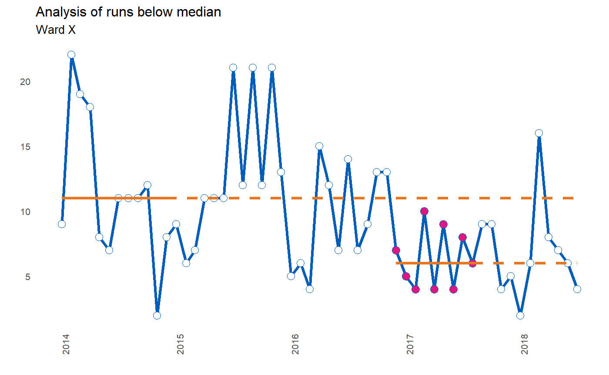
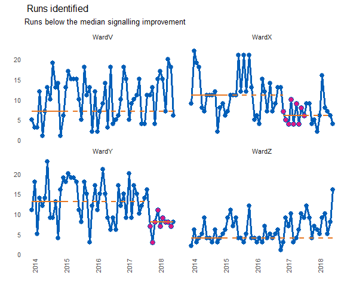
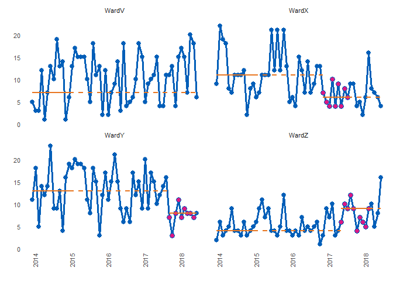

<!-- README.md is generated from README.Rmd. Please edit that file -->
runcharter
==========

Automated analysis and re-basing of runcharts at scale.

Online documentation and vignettes : [runcharter](https://www.johnmackintosh.com/runcharter/)

[](https://travis-ci.org/johnmackintosh/runcharter) [](https://www.repostatus.org/#wip) [](https://codecov.io/github/johnmackintosh/runcharter?branch=master)

Installation
------------

You can install runcharter from github with:

``` r
# install.packages("devtools")
devtools::install_github("johnmackintosh/runcharter")
```

Rationale
---------

Runcharts are easy to create and analyse on an individual basis, hence they are widely used in healthcare quality improvement.

A runchart is a regular line chart, but with a central reference line, calculated over a baseline period before any quality improvement takes place.

This central line, calculated using the median of a number of baseline values, is plotted, allowing the QI team to assess if any statistically significant improvement is taking place, as a result of their improvement initiatives.

These improvements are denoted by certain patterns, or signals, within the plotted data points, in relation to the median line. The main signal is a run of 9 or more consecutive values on the desired side of the median line.

If this signal occurs as a result of improvement activities, a new median can be calculated using the points that contributed to this run. While this 'rebasing' (calculating new medians) is manageable for a few charts, it quickly becomes labour intensive as QI initiatives expand or further QI programmes are launched.

While enterprise level database software can be used to store the raw data, their associated reporting systems are usually ill suited to the task of analysing QI data using run chart rules.

This package automatically creates rebased run charts, based on the run chart rule for sustained improvement commonly used in healthcare ( n consecutive points on the desired side of the median).

All sustained runs of improvement, in the desired direction, will be highlighted and the median re-phased, using the points that contributed to the run.

Non useful observations (points on the median) are ignored and are not highlighted.

The main motivation is to analyse many charts at once, but you can also create and analyse a single runchart, or iterate, plot and save many individual charts.

The runcharter function - input
-------------------------------

The function requires a simple three column dataframe, with the following column names

-   "grp" : a character column indicating a grouping variable to identify each individual run chart and for faceted plots
-   "date" : a column of type 'date'.
-   "y" : the variable / value to plot.

runcharter function arguments
-----------------------------

-   "df" : a three column dataframe with columns named 'grp', 'date' and 'y' as specified above
-   "med\_rows" : How many rows / data points should the initial baseline median be calculated over?
-   "runlength" : How long a run of consecutive points do you want to find, before you rebase the median? The median will be rebased using all useful observations (points on the median are not useful, and are ignored).
-   "chart\_title" : The main title for the chart
-   "chart\_subtitle" : A subtitle for the chart
-   "direction" : Is improvement indicated by a run "above" the median, or "below" the median? The function will only look for successive runs in one direction. It will find multiple runs below the median, or multiple runs above the median, but will not look for alternating runs or runs in both directions at once.
-   faceted : defaults to TRUE. Set to FALSE if you only need to plot a single runchart.
-   facet\_cols : the number of columns in a faceted plot - only required if faceted is set to TRUE, otherwise ignored
-   save\_plot : Calls ggsave if TRUE, saving in the current working directory
-   plot\_extension : one of "png","pdf" or other valid extension for saving ggplot2 plots. Used in the call to ggsave.

example plot
------------

``` r
library(runcharter)
library(dplyr)
#> 
#> Attaching package: 'dplyr'
#> The following objects are masked from 'package:stats':
#> 
#>     filter, lag
#> The following objects are masked from 'package:base':
#> 
#>     intersect, setdiff, setequal, union

single <- signals %>%
dplyr::filter(grp == "WardX") %>%
runcharter(med_rows = 13,
runlength = 9,
chart_title = "Analysis of runs below median",
chart_subtitle = "Ward X",
direction = "below",
faceted =  FALSE)
#> all sustained runs found, not enough rows remaining for further analysis
```



Plot explanation
----------------

"med\_rows" defines the initial baseline period. In the example below, the first 13 points are used to calculate the initial median. This is represented with a solid orange horizontal line. This median is then used as a reference for the remaining values, denoted by the extending orange dashed line

"runlength" specifies the length of run to be identified. Along with "direction", which specifies which side of median represents improvement, the runlength is your target number of successive points on the desired side of the median (points on the median are ignored as they do not make or break a run).

If a run is identified, the points are highlighted (the purple coloured points), a new median is calculated using these points, and plotted, and extended, with a new set of solid and dashed horizontal lines.

The analysis continues, rebasing any further runs, until no more runs are found or there are not enough data points remaining.

Example
-------

By default the function returns a faceted plot, highlighting successive runs below the median:

``` r
library(runcharter)
runcharter(signals, faceted = TRUE, facet_cols = 2)
#> $runchart
```



    #> 
    #> $median_rows
    #> # A tibble: 52 x 4
    #>    grp       y date       baseline
    #>    <chr> <int> <date>        <int>
    #>  1 WardX     9 2014-01-01       11
    #>  2 WardX    22 2014-02-01       11
    #>  3 WardX    19 2014-03-01       11
    #>  4 WardX    18 2014-04-01       11
    #>  5 WardX     8 2014-05-01       11
    #>  6 WardX     7 2014-06-01       11
    #>  7 WardX    11 2014-07-01       11
    #>  8 WardX    11 2014-08-01       11
    #>  9 WardX    11 2014-09-01       11
    #> 10 WardX    12 2014-10-01       11
    #> # ... with 42 more rows
    #> 
    #> $sustained
    #> # A tibble: 18 x 10
    #>    grp       y date        flag rungroup cusum improve startdate 
    #>    <chr> <int> <date>     <dbl>    <dbl> <dbl>   <int> <date>    
    #>  1 WardX     7 2016-12-01    -1        1    -1       6 2016-12-01
    #>  2 WardX     5 2017-01-01    -1        1    -2       6 2016-12-01
    #>  3 WardX     4 2017-02-01    -1        1    -3       6 2016-12-01
    #>  4 WardX    10 2017-03-01    -1        1    -4       6 2016-12-01
    #>  5 WardX     4 2017-04-01    -1        1    -5       6 2016-12-01
    #>  6 WardX     9 2017-05-01    -1        1    -6       6 2016-12-01
    #>  7 WardX     4 2017-06-01    -1        1    -7       6 2016-12-01
    #>  8 WardX     8 2017-07-01    -1        1    -8       6 2016-12-01
    #>  9 WardX     6 2017-08-01    -1        1    -9       6 2016-12-01
    #> 10 WardY     7 2017-10-01    -1        1    -1       8 2017-10-01
    #> 11 WardY     3 2017-11-01    -1        1    -2       8 2017-10-01
    #> 12 WardY     8 2017-12-01    -1        1    -3       8 2017-10-01
    #> 13 WardY    11 2018-01-01    -1        1    -4       8 2017-10-01
    #> 14 WardY     7 2018-02-01    -1        1    -5       8 2017-10-01
    #> 15 WardY     9 2018-03-01    -1        1    -6       8 2017-10-01
    #> 16 WardY     8 2018-04-01    -1        1    -7       8 2017-10-01
    #> 17 WardY     8 2018-05-01    -1        1    -8       8 2017-10-01
    #> 18 WardY     7 2018-06-01    -1        1    -9       8 2017-10-01
    #> # ... with 2 more variables: enddate <date>, lastdate <date>
    #> 
    #> $StartBaseline
    #> [1] 11 13  4  7

For the time being, the function requires a three column data frame, containing the named variables "grp", "y" and "date": "grp" is a grouping variable which will be used for faceting. "y" is the variable on the y axis. You are encouraged to ensure that any doubles have been rounded appropriately. "date" is a date column.

The function will print the plot, and return a list, containing:

-   a ggplot2 object,
-   a dataframe / tibble containing the rows of data used to calculate the baseline median
-   if applicable, a dataframe / tibble showing the points in each sustained period of improvement.
-   the initial baseline median value

The latter 3 items can be retrieved from the list and used to create new plots (if, for example, you would like different plot themes or colours from the package defaults)

Don't try this at home - setting runlength of 3 to show that successive runs are identified:

``` r

signals %>% 
  runcharter(med_rows = 3,
             runlength = 3, 
             direction = "above",
             faceted = TRUE,
              facet_cols = 2)
#> $runchart
```



    #> 
    #> $median_rows
    #> # A tibble: 12 x 4
    #>    grp       y date       baseline
    #>    <chr> <int> <date>        <int>
    #>  1 WardX     9 2014-01-01       19
    #>  2 WardX    22 2014-02-01       19
    #>  3 WardX    19 2014-03-01       19
    #>  4 WardY    11 2014-01-01       11
    #>  5 WardY    18 2014-02-01       11
    #>  6 WardY     5 2014-03-01       11
    #>  7 WardZ     2 2014-01-01        3
    #>  8 WardZ     6 2014-02-01        3
    #>  9 WardZ     3 2014-03-01        3
    #> 10 WardV     5 2014-01-01        3
    #> 11 WardV     3 2014-02-01        3
    #> 12 WardV     3 2014-03-01        3
    #> 
    #> $sustained
    #> # A tibble: 24 x 10
    #>    grp       y date        flag rungroup cusum improve startdate 
    #>    <chr> <int> <date>     <dbl>    <dbl> <dbl>   <int> <date>    
    #>  1 WardY    14 2014-04-01     1        1     1      14 2014-04-01
    #>  2 WardY    12 2014-05-01     1        1     2      14 2014-04-01
    #>  3 WardY    14 2014-06-01     1        1     3      14 2014-04-01
    #>  4 WardY    16 2014-12-01     1        2     1      18 2014-12-01
    #>  5 WardY    19 2015-01-01     1        2     2      18 2014-12-01
    #>  6 WardY    18 2015-02-01     1        2     3      18 2014-12-01
    #>  7 WardY    20 2015-03-01     1        3     1      19 2015-03-01
    #>  8 WardY    19 2015-04-01     1        3     2      19 2015-03-01
    #>  9 WardY    19 2015-05-01     1        3     3      19 2015-03-01
    #> 10 WardZ     4 2014-04-01     1        1     1       5 2014-04-01
    #> # ... with 14 more rows, and 2 more variables: enddate <date>,
    #> #   lastdate <date>
    #> 
    #> $StartBaseline
    #> [1] 19 11  3  3
