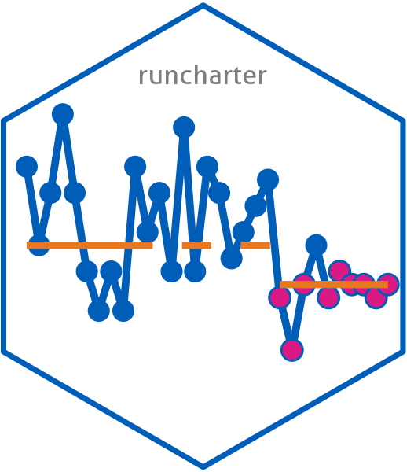
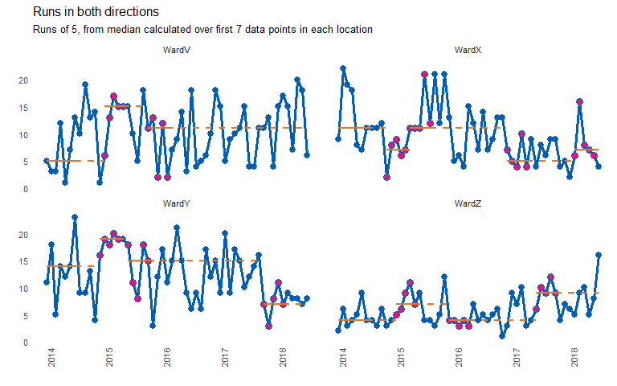

<!-- README.md is generated from README.Rmd. Please edit that file -->

# runcharter 

Automated analysis and re-basing of run charts at scale.

Online documentation and vignettes :
<https://johnmackintosh.github.io/runcharter/>

<!-- badges: start -->

[](https://github.com/johnmackintosh/runcharter/actions)

[](https://www.repostatus.org/#active)
[](https://codecov.io/github/johnmackintosh/runcharter?branch=master)
[](https://github.com/johnmackintosh/runcharter/actions/workflows/render-readme.yaml)
[](https://app.codecov.io/gh/johnmackintosh/runcharter?branch=master)
[](https://CRAN.R-project.org/package=runcharter)
<!-- badges: end -->

## Installation

You can install the latest stable version from CRAN with:

``` r
install.packages("runcharter")
```

You can install the development version from github with:

``` r
# install.packages("remotes") # if not already installed
remotes::install_github("johnmackintosh/runcharter")

# to ensure the vignettes are built or ensure latest version is installed:

remotes::install_github("johnmackintosh/runcharter", 
                         build_vignettes = TRUE)
```

The rationale for the package is to analyse multiple run charts at once.
More importantly, the package will identify a run of n successive points
on the desired side of the median line, and will recalculate / rebase
the median accordingly. Each time a run occurs, the median will be
rebased. This helps to track improvements over time.

The default is to plot a faceted plot, allowing ggplot2 to handle the
axis limits. You can specify the number of columns in the faceted plot
however, and you can also specify both the breaks for date labels on the
x axis, and whether the y axis limits are fixed, or can vary by facet
panel.

# Function arguments and defaults

A default run of 9 is specified as that is the length of run used by the
IHI for its patient safety initiatives worldwide.

``` r
library(runcharter)
runcharter(df = signals,
          med_rows = 13,
          runlength = 9,
          direction = "below",
          datecol = NULL,
          grpvar = NULL,
          yval = NULL,
          facet_cols = NULL,
          facet_scales = "fixed",
          chart_title = NULL,
          chart_subtitle = NULL,
          chart_caption = NULL,
          chart_breaks = NULL,
          line_colr = "#005EB8", # blue
          point_colr ="#005EB8", # blue
          median_colr = "#E87722", # orange
          highlight_fill = "#DB1884") # magenta
```

The function will return a plot and a summary table showing the original
baseline medians, and any sustained runs of improvement beyond the
baseline period.

``` r
library(runcharter)

runcharter(signals,
           direction = "below",
           datecol = date, 
           grpvar = grp,
           yval = y, 
          chart_title = "Runs identified",
          chart_subtitle = "Runs below the median signalling improvement")
#> $runchart
```

<!-- -->

    #> 
    #> $sustained
    #>      grp median start_date   end_date  extend_to  run_type
    #> 1: WardV      7 2014-01-01 2015-01-01 2018-07-01  baseline
    #> 2: WardX     11 2014-01-01 2015-01-01 2016-12-01  baseline
    #> 3: WardY     13 2014-01-01 2015-01-01 2017-10-01  baseline
    #> 4: WardZ      4 2014-01-01 2015-01-01 2018-07-01  baseline
    #> 5: WardX      6 2016-12-01 2017-08-01 2018-07-01 sustained
    #> 6: WardY      8 2017-10-01 2018-06-01 2018-07-01 sustained

## Runs in both directions

The package allows for finding runs in both directions (above and below
the median). Generally, for improvement purposes, you would only need to
identify runs in one direction at a time. In other words, if you are
trying to reduce adverse events, improvement will be evidenced with a
run below the median. Therefore, you would not rebase the median if a
run of points above the median was observed.

However, for longer term monitoring, it may be necessary to identify and
‘reset’ a median if a sustained deterioration in performance occurs.
Ideally, you should move to using SPC charts for monitoring purposes.

``` r
library(runcharter)
signals %>% 
  runcharter(med_rows = 7, 
             runlength = 5,
             direction = "both",
             datecol = date, 
              grpvar = grp,
              yval = y, 
             chart_title = "Runs in both directions",
             chart_subtitle = "Runs of 5, from median calculated over first 7 data points in each location")
#> $runchart
```

<!-- -->

    #> 
    #> $sustained
    #>       grp median start_date   end_date  extend_to  run_type
    #>  1: WardV      5 2014-01-01 2014-07-01 2015-01-01  baseline
    #>  2: WardX     11 2014-01-01 2014-07-01 2014-11-01  baseline
    #>  3: WardY     14 2014-01-01 2014-07-01 2014-12-01  baseline
    #>  4: WardZ      4 2014-01-01 2014-07-01 2015-01-01  baseline
    #>  5: WardV     15 2015-01-01 2015-05-01 2015-10-01 sustained
    #>  6: WardX      7 2014-11-01 2015-03-01 2015-04-01 sustained
    #>  7: WardY     19 2014-12-01 2015-04-01 2015-06-01 sustained
    #>  8: WardZ      7 2015-01-01 2015-05-01 2015-12-01 sustained
    #>  9: WardV     11 2015-10-01 2016-02-01 2018-07-01 sustained
    #> 10: WardX     11 2015-04-01 2015-08-01 2016-12-01 sustained
    #> 11: WardY     15 2015-06-01 2015-10-01 2017-10-01 sustained
    #> 12: WardZ      4 2015-12-01 2016-04-01 2017-06-01 sustained
    #> 13: WardX      5 2016-12-01 2017-04-01 2018-02-01 sustained
    #> 14: WardY      7 2017-10-01 2018-02-01 2018-07-01 sustained
    #> 15: WardZ      9 2017-06-01 2017-10-01 2018-07-01 sustained
    #> 16: WardX      7 2018-02-01 2018-06-01 2018-07-01 sustained

## Design decisions and similar packages

This package makes no attempt to identify or highlight ‘trends’
(consecutively increasing or decreasing points) or shorter ‘shifts’ of
runs below the median. In 8 years of working with QI data, I very rarely
see trends, and when they do appear, they tend to result after a period
of process degradation, when the process begins to return back to its
natural median state.

In addition, research by qicharts2 author Jacob Anhoej shows that the
trend rule is not reliable. There are no plans to add tests to identify
trends to the package.

However, analysts are often asked to apply all the run chart rules.  
In this case, if you need to apply the rules for trend , and still have
the ability to revise run chart medians, you should consider using [the
runchart package by Joseph Adams](https://github.com/jsphdms/runchart).

[qicharts2](https://github.com/anhoej/qicharts2) creates run and SPC
charts. These can be rebased, but you must specify when to do so. Also,
the analysis is based on the author’s own rules and not the rules
typically used in healthcare (e.g. the rules promoted by the IHI).

## Turn off run chart analysis

You can avoid rebasing medians by setting ‘runlength’ to 0 (zero). This
will plot the runcharts with the original baseline medians, but no runs
analysis will take place.

``` r
library(runcharter)
signals %>% 
  runcharter(med_rows = 13,
             runlength = 0, 
             datecol = date,
              grpvar = grp, 
              yval = y,
             direction = "both")
#> $runchart
```

<!-- -->

    #> 
    #> $sustained
    #>      grp median start_date   end_date  extend_to run_type
    #> 1: WardV      7 2014-01-01 2015-01-01 2018-07-01 baseline
    #> 2: WardX     11 2014-01-01 2015-01-01 2018-07-01 baseline
    #> 3: WardY     13 2014-01-01 2015-01-01 2018-07-01 baseline
    #> 4: WardZ      4 2014-01-01 2015-01-01 2018-07-01 baseline

Similarly, you can plot basic line charts by setting ‘med\_rows’ to 0
(zero)

``` r
library(runcharter)
signals %>% 
  runcharter(med_rows = 0,
             runlength = 9, 
             datecol = date,
              grpvar = grp, 
              yval = y,
             direction = "both")
#> $runchart
```

<!-- -->

    #> 
    #> $sustained
    #>      grp median start_date   end_date  extend_to run_type
    #> 1: WardV     NA 2014-01-01 2014-01-01 2018-07-01 baseline
    #> 2: WardX     NA 2014-01-01 2014-01-01 2018-07-01 baseline
    #> 3: WardY     NA 2014-01-01 2014-01-01 2018-07-01 baseline
    #> 4: WardZ     NA 2014-01-01 2014-01-01 2018-07-01 baseline

removed blank space
